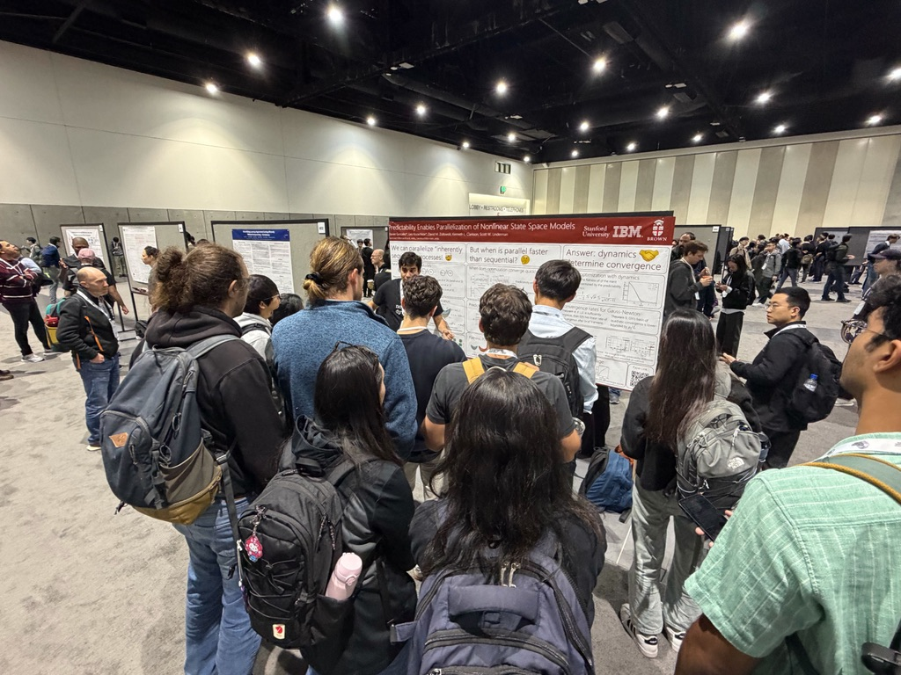

{width=50%}

I love giving research talks. Please reach out if you would like me to speak at your research seminar or colloqium!

## Long talks

Here is an hour-long talk I gave at the with my collaborator Leo Kozachkov on parallelizing "inherently sequential" processes.

**[Talk link. Date: 9/30/25](https://www.youtube.com/watch?v=C9AqgW51-B4)**

## Poster Talks

* 14-min video of my poster presentation of [Predictability Enables Parallelization of Nonlinear SSMs](https://www.youtube.com/watch?v=SVTz4aTIcPs&t=4s) at NeurIPS '25'

## Lightning talks

Here are two 5-minute talks about my NeurIPS papers:

* [Towards Scalable and Stable Parallelization of Nonlinear RNNs](https://slideslive.com/39027951/towards-scalable-and-stable-parallelization-of-nonlinear-rnns). NeurIPS '24.
* [Predictability Enables Parallelization of Nonlinear SSMs](https://neurips.cc/virtual/2025/loc/san-diego/poster/119734). NeurIPS '25.